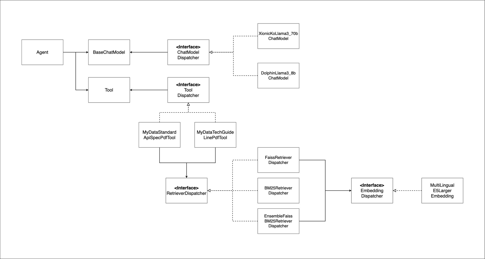

## 마이데이터 챗봇 Agent

- 마이데이터 공식 문서를 기반으로 정책과 기술 사양 등을 답변해주는 에이전트

## 프로젝트 구조

```text
mydata-agent
├── app.py  # FastAPI app
├── ui.py  # streamlit app
├── readme.md
├── requirements.txt
├── chat_model  # langchain ChatModel을 가져오기 위한 인터페이스 및 구현체
│ ├── ChatModelDispatcher.py
│ ├── DolphinLlama3_8bChatModel.py
│ └── XionicKoLlama3_70bChatModel.py
├── config  # 의존성 주입을 위한 클래스
│ └── Config.py
├── data  # 마이데이터 문서
│ ├── (221115 수정배포) (2022.10) 금융분야 마이데이터 기술 가이드라인.pdf
│ └── (수정게시) 금융분야 마이데이터 표준 API 규격 v1.pdf
├── embedding  # langchain Embedding Model을 가져오기 위한 인터페이스 및 구현체. 주로 Retriever 구축 시 사용
│ ├── EmbeddingDispatcher.py
│ └── MultiLingualE5LargeEmbedding.py
├── img
│ ├── class_diagram.png
│ └── system_flowchart.png
├── retriever  # langchain retriever를 가져오기 위한 인터페이스 및 구현체
│ ├── BM25RetrieverDispatcher.py
│ ├── EnsembleFaissBM25RetrieverDispatcher.py
│ ├── FaissRetrieverDispatcher.py
│ ├── RaptorFaissRetrieverDispatcher.py
│ ├── RetrieverDispatcher.py
├── tool  # langchin tool을 가져오기 위한 인터페이스 및 구현체
│ ├── ToolDispatcher.py
│ └── pdf
│   ├── MyDataStandardApiSpecPdfTool.py
│   └── MyDataTechGuideLinePdfTool.py
```

## 시스템 흐름도


1. streamlit을 통해 UI 화면 접근
2. streamlit에서 유저가 질문 시 FastAPI 서버로 요청 전송
3. FastAPI 내에서 Agent를 사용해 RAG을 수행
4. Retriever에서는 사전에 정의한 마이데이터 공식 문서의 VectorStore와 사용자의 입력을 비교해 관련된 문서를 탐색
5. Retriever에서 탐색한 문서와 사용자 입력을 LLM에 넣어 답변을 생성

## 클래스 다이어그램



- Agent에서 ChatModel과 Tool List를 입력으로 받는다.
- `ChatModelDispatcher` Interface를 통해 필요한 ChatModel을 정의
    - llama나 GPT와 같은 ChatModel을 OCP를 지키면서 추가할 수 있다.
- `ToolDispatcher` Interface를 통해 필요한 Tool을 정의
    - PDF search Tool, Web search Tool, Image Embedding Tool 등 다양한 Tool을 OCP를 지키면서 추가할 수 있다.
- PDF Tool에서는 `RetrieverDispatcher` interface를 통해 필요한 Retriever를 주입받는다.
    - 상황에 맞는 다양한 Retriever를 선택할 수 있다.
        - ex) `FaissRetriever`, `BM25Retriever`, `EnsembleRetriever`, `RaptorRetriever`, ..
    - 새로운 Retriever가 추가되더라도 OCP를 지키면서 추가할 수 있다.
- 특정 Retriever(e.g. `FaissRetriever`)에서는 Retriver를 구축하기 위해 Embedding Model이 필요하다.
    - `EmbeddingDispatcher` interface를 통해 필요한 Embedding Model을 주입받는다.
    - 새로운 Embedding Model(e.g. Ada Embedding Model)을 추가하더라도 OCP를 지키면서 추가할 수 있다.

### 의존성 주입(Dependency Injection)

```python
class Config:

    @classmethod
    def embedding_model(cls) -> Embeddings:
        return MultiLingualE5LargeEmbedding.get_embedding()

    @classmethod
    def tools(cls) -> List[Tool]:
        tools = [
            MyDataStandardApiSpecPdfTool.get_tool(
                retriever_dispatcher=cls.get_retriever_dispatcher()
            ),
            MyDataTechGuideLinePdfTool.get_tool(
                retriever_dispatcher=cls.get_retriever_dispatcher()
            )
        ]

        return tools

    @classmethod
    def get_retriever_dispatcher(cls) -> RetrieverDispatcher:
        return EnsembleFaissBM25RetrieverDispatcher(
            text_splitter=cls.text_splitters(),
            embedding_model=cls.embedding_model(),
        )

    @classmethod
    def chat_model(cls) -> BaseChatModel:
        return XionicKoLlama3_70bChatModel.get_chat_model()

    @classmethod
    def text_splitters(cls) -> TextSplitter:
        return RecursiveCharacterTextSplitter(
            chunk_size=2000,
            chunk_overlap=100)

    @classmethod
    def prompt(cls) -> ChatPromptTemplate:
        return hub.pull("teddynote/react-chat-json-korean")
```

- `Config` class에서 모든 의존성을 주입
- 각 클래스는 lazy loading 기반 singleton instance를 사용해 여러번 호출되더라도
- 해당 class에만 모든 의존성을 갖고 있고, 그 외에는 interface를 기반으로 동작
- 새로운 component가 추가되더라도 Config class만 수정하면 기존 코드를 수정하지 않고 새로운 기능을 추가할 수 있다.

## 환경 설정

### 가상 환경 설정

```shell
conda create --name mydata-agent python=3.11.9 -y
conda activate mydata-agent
pip install -r requirements.txt
```

### Ollama 설치

```shell
# linux
curl -fsSL https://ollama.com/install.sh | sh
ollama serve
ollama pull dolphin-llama3:8b
```

- [Ollama download 공식 홈페이지](https://ollama.com/download)

### 테스트 코드 수행

```shell
pytest
```

## 실행 방법

1. streamlit 실행

```shell
streamlit run ui.py 
```

2. fastAPI 실행

```shell
python app.py
```

## 추가 구현 사항

### 디버깅

`.env` 파일 내에 `langsmith` 설정을 통해 tools이 제대로 사용되는지 확인

.env파일 예시

```text
LANGCHAIN_TRACING_V2=true
LANGCHAIN_ENDPOINT="https://api.smith.langchain.com"
LANGCHAIN_API_KEY="<API-KEY>"
LANGCHAIN_PROJECT="<PROJECT-NAME>"
```

### 동시성 문제

- fastAPI에서 들어온 요청을 request_queue에 저장해 micro batch로 들어온 요청을 한번에 처리
- 지나치게 많은 요청이 들어오게 되는 경우 일시적으로 사용자 요청을 처리하지 않도록 함

```python
@app.post("/chat")
async def predict(user_input: str):
    # 지나치게 많은 요청이 들어오게 되는 경우 일시적으로 사용자 요청을 처리하지 않도록 함
    if len(request_queue) > MAX_PENDING_REQUESTS:
        return "현재 요청이 너무 많습니다. 잠시 후 다시 시도해주세요."

    # 들어온 요청을 request_queue에 저장해 micro batch로 처리할 수 있도록 함
    request_id = str(uuid.uuid4())
    future = asyncio.Future()

    pending_responses[request_id] = future
    request_queue.append({"id": request_id, "user_input": user_input})

    response = await future
    return response
```

```python
async def process_batch():
    while True:
        await asyncio.sleep(MAX_DELAY_SECONDS)
        if request_queue:
            batch_data = request_queue[:]
            request_queue.clear()
            logger.info(f"process batch.. current queue size : {len(batch_data)}")

            responses = executor.batch([{"input": request["user_input"]} for request in batch_data])
            for request, response in zip(batch_data, responses):
                request_id = request["id"]
                if request_id in pending_responses:
                    pending_responses[request_id].set_result(response["output"])
                    del pending_responses[request_id]
```

- 주기적으로 request_queue를 확인하면서 request_queue에 request가 존재하는 경우 batch로 처리
- 추가적으로 사용자별 ID를 request 시에 입력받는다면, 사용자별 rate limiter를 설정할 수 있다.

### 모델 토큰 제한

- 마이데이터 공식 문서를 `TextSplitter`를 사용해 특정 길이의 chunk로 분리하여 모델에 들어가는 최대 document token 수를 제한

```python
# In FaissRetrieverDispatcher
def get_retriever(self, docs: Union[BaseLoader, List[Document]]) -> BaseRetriever:
    if isinstance(docs, BaseLoader):
        if self.embedding_model is None or not isinstance(self.text_splitter, TextSplitter):
            docs = docs.load()
        else:
            docs = docs.load_and_split(self.text_splitter)

    faiss_vector_store = FAISS.from_documents(docs, embedding=self.embedding_model)

    return faiss_vector_store.as_retriever()
```

- 이 외 추가적으로 `RaptorRetriever`와 같은 기법을 사용해 작은 토큰 수를 기반으로 long context에 대한 정보를 유지하도록 할 수 있다.
- 더 간단하게는 사용자 입력이 특정 수 이상이거나, 문서의 길이가 너무 긴 경우 요약 모델을 사용해 전체 크기를 줄이는 방법을 사용할 수 있다.


